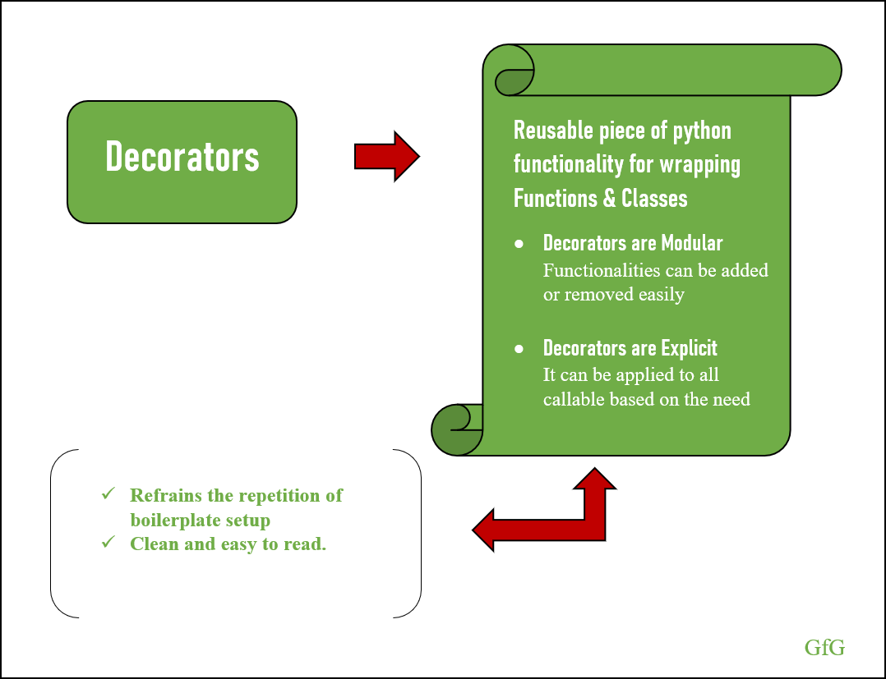
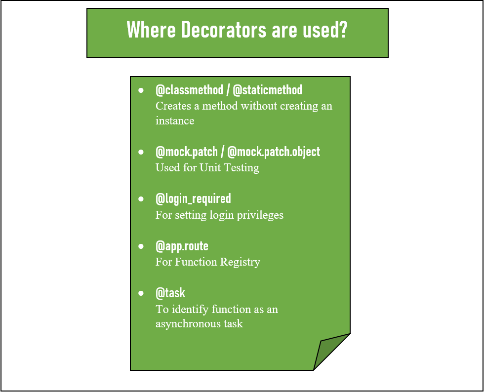
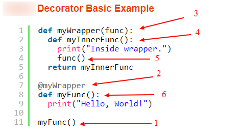
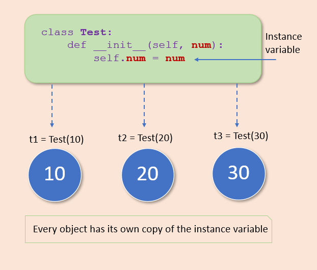
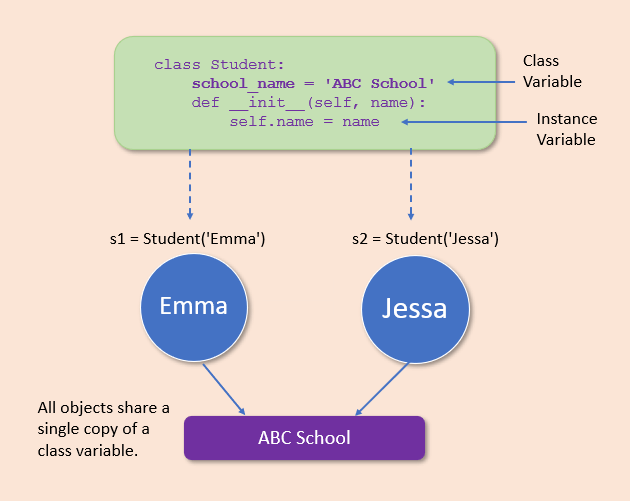

<h2>OOP 2: Class Methods, Class Variables & Object Relationships</h2>

---

<h3><strong> ✅ Objectives </strong></h3>

- Learn about decorators
  - what are they? {.fragment}
  - how are they useful in Python classes? {.fragment}
  - Python's "pie" syntax {.fragment}
- Understand class variables {.fragment}
  - how to define and update their value {.fragment}
- Write class methods {.fragment}
  - use the `@classmethod` decorator {.fragment}
  - `cls` keyword {.fragment}

xxx

- Object inheritance {.fragment}
  - how is it useful? {.fragment}
  - inherited or overwritten? {.fragment}
  - calling `super()` {.fragment}

xxx

- Build one-to-many relationships between objects {.fragment}
    - Discuss their importance and use {.fragment}
    - Emphasize single-source-of-truth {.fragment}
    - Demonstrate building one-way and two-way relationships {.fragment}
- Build many-to-many relationships between objects {.fragment}
    - Discuss their importance and use {.fragment}
    - Demonstrate building the relationship with and without intermediary class {.fragment}
- Aggregate Methods {.fragment}
    - Write aggregate methods to collect data about objects using their related objects {.fragment}

---

#### What are decorators? 🪴 🛋️

---

  

    
Decorators give us an easy way to extend a method's functionality without altering the method.

  

  

    
  

---

#### Decorators are higher-order functions

They take in a function as an argument, and return a function.

The "pie", <code>@decorator</code>, syntax makes decorators easier to implement in our code.

#### Let's try it! 🏈 {.fragment}

---

### Class Variables

  

    
  

  

    We have used instance variables (attributes) to assign unique values to instances of a class. How could we assign a univeral value which would be the same for all instances?
  

---

Every object instantiated from the class has read and write access to its class variables.

