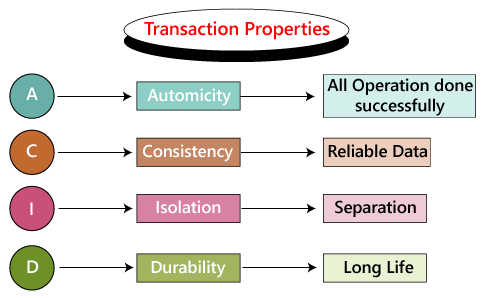
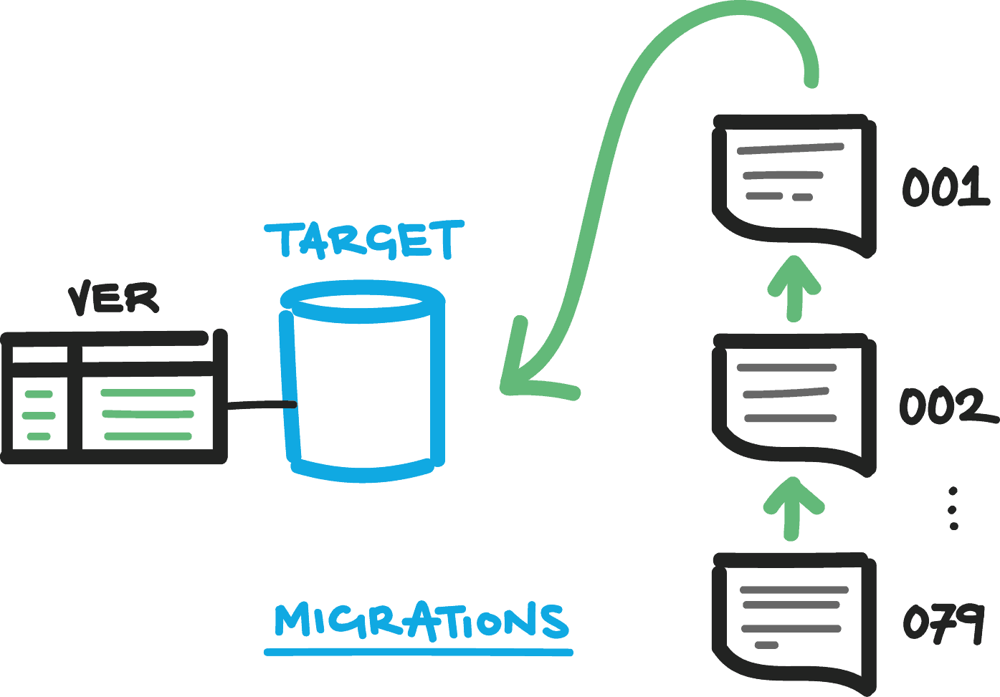

<h2>SQLAlchemy & Alembic</h2>


---

<h3><strong> ✅ Objectives </strong></h3>

* Understand what SQLAlchemy is and how it's beneficial as an ORM
* Know how to create a database with SQLAlchemy
* Create schema
* Understand what Alembic is and how it works with SQLAlchemy
* Configure an app to use Alembic
* Create and apply migrations
* Execute full CRUD using SQLAlchemy

---

### What is SQLAlchemy?

> "SQLAlchemy is the Python SQL  toolkit and Object Relational Mapper that gives application developers the full power and flexibility of SQL."


---


xxx


---


### What is a **schema**?

A **schema** is the blueprint of a database. It describes how data relates to other data in tables, columns, and the relationships between

We define our schema with Python classes we will call "models".

---

First we import the elements we'll need from SQLAlchemy...

```python
from sqlalchemy import Column, Integer, PrimaryKeyConstraint, String
from sqlalchemy.ext.declarative import declarative_base

Base = declarative_base()
```

---

Then we create a model class which inherits the ORM functionality from the Base class.

```python[1|2|4|5-8]
class Pet(Base):
    __tablename__ = "pets"

    id = Column(Integer(), primary_key=True)
    name = Column(String())
    species = Column(String())
    breed = Column(String())
    temperament = Column(String())
```

---

For debugging and readability, let's add a `__repr__()` to our model!

```python
class Pet(Base):

  # (...model logic...)

  def __repr__(self):
    return (
            f"Id: {self.id}, "
            + f"Name:{self.name}, "
            + f"Species {self.species}, "
            + f"Breed {self.breed}, "
            + f"Species {self.temperament}"
        )

```
#### Let's jump into the code! {.fragment}

---

### What is an **engine**?

In SQLAlchemy, an **engine** is a Python object that translates SQL to Python and vice-versa.
It is similar to our `connection` object in `sqlite3`.
We'll need an engine to apply our schema to our database.

---


---

### What is a **session**?

A Python object that uses an engine to allow us to programmatically interact with a database.

---


<section data-background-color="mistyrose">
  <h3>What is a <strong>transaction</strong>?</h3>
  <p>A strategy for executing database statements such that the group suceeds or fails as a unit.</p>
  
</section>

xxx

<section data-background-color="mistyrose">
  <div style="display: flex;">
    <div style="width: 35%">
      
    </div>
    <div style="width: 65%">
      
    </div>
  </div>
</section>

---

### What is **Alembic**?

A database migration tool written by the author of SQLAlchemy

---

<section data-background-color="mistyrose">
  <h3>What is a schema migration?</h3>
  <p>A controlled, incremental and reversible change to a relational database's schema.  A set of migrations can be applied to a database, or rolled back in a sequential and granular fashion.
  </p>
  
</section>

---


